<!-- ========================= HERO ========================= -->

 

  

---

<!-- ========================= TERMINAL ========================= -->

---

<!-- ========================= ABOUT ========================= -->

## 👨‍💻 About Me

I'm an **Open Source Contributor** interested in AI/ML, cloud-native systems, developer tools, and distributed software.

I enjoy building real-world projects and contributing to open-source communities while continuously improving my engineering skills.

### 🚀 Currently Building

- 🤖 AI/ML & LLM applications
- 🧠 AI Agents and developer tools
- ☁️ Cloud-native systems
- 🐳 Kubernetes & container technologies
- 🔧 Developer productivity tools

---

<!-- ========================= PROJECTS ========================= -->

## 🚀 Featured Projects

| Project | Description |
|---|---|
| 🔥 **APCode** | Offline-first AI coding agent |
| 🧠 **LLM Wiki** | Local-first AI knowledge & code intelligence |
| 🎮 **AlgoVerse** | Gamified DSA & ML learning platform |

---

<!-- ========================= TECH STACK ========================= -->

## 🛠️ Tech Stack

### Languages

`Python` `Go` `C++` `Java` `JavaScript` `Dart`

### AI / ML

`PyTorch` `LLMs` `RAG` `AI Agents` `Machine Learning`

### Cloud / DevOps

`Kubernetes` `Docker` `GitHub Actions` `Linux`

### Backend

`FastAPI` `Go` `PostgreSQL` `Redis`

---

<!-- ========================= OPEN SOURCE ========================= -->

## 🌎 Open Source

- ☸️ Kubernetes
- ☁️ CNCF ecosystem
- 🐧 Cloud-native projects
- 🤖 AI/ML open-source projects

---

<!-- ========================= GITHUB ========================= -->

## 📊 GitHub

 

---

<!-- ========================= QUOTE ========================= -->

## 💭 Quote

> **"Learning in silence. Building in public."**

⭐ **Thanks for visiting my profile!**

